# Product Requirements Document (PRD)
## Saudi Accounting & ZATCA ERP Suite (v15)

---

### 1. Executive Summary
The **Saudi Accounting & ZATCA ERP Suite (v15)** is an enterprise-grade, self-hosted Enterprise Resource Planning (ERP) platform natively localized for companies operating in the **Kingdom of Saudi Arabia (KSA)**. The platform solves the dual challenge of complete financial and operational management while ensuring 100% compliance with the mandatory electronic invoicing regulations issued by the **Zakat, Tax and Customs Authority (ZATCA / Fatoora)**.

---

### 2. Strategic Objectives & Value Proposition
1. **Regulatory Compliance Guarantee:** Out-of-the-box compliance with ZATCA Phase 1 (e-invoice generation with TLV Base64 QR code) and Phase 2 (integration with UBL 2.1 XML, ICV sequential counting, and SHA-256 cryptographic hash chaining).
2. **Data Sovereignty:** 100% on-premise / private-cloud Docker container topology guaranteeing financial data never leaves Saudi Arabian jurisdiction, meeting CITC/NCA cloud computing regulatory frameworks.
3. **End-to-End Enterprise Scope:** Unified financial accounting, 15% VAT compliance, sales & receivables, procurement & payables, multi-warehouse inventory, and executive business intelligence.
4. **Bilingual Accessibility:** Complete native interface and print output parity between Arabic (RTL) and English (LTR).

---

### 3. Target User Personas

| Persona | Role | Core Goals & Pain Points | Primary Modules Used |
| :--- | :--- | :--- | :--- |
| **Chief Financial Officer (CFO)** | Executive Financial Leadership | Real-time P&L, balance sheet integrity, cash flow visibility, audit-proof tax returns. | Financial Accounting, General Ledger, Financial Reports, VAT Return |
| **Chief Accountant / Tax Specialist** | Compliance & Day-to-Day Accounting | Accurate 15% VAT calculation, journal entries, bank reconciliations, ZATCA tax audit trail. | Chart of Accounts, Invoicing, Tax Templates, GL Entry |
| **Sales & Operations Manager** | Revenue & Customer Fulfilment | Fast quotation-to-invoice pipeline, credit limits, immediate QR code generation on sales counter. | Selling, Sales Invoices, Customer Master, POS |
| **Procurement & Warehouse Manager** | Supply Chain & Stock Valuation | Real-time stock levels across warehouses, FIFO valuation, automated purchase orders. | Buying, Stock Ledger, Multi-Warehouse, Item Master |
| **Enterprise IT / DevOps Engineer** | System Reliability & Security | Single-command Docker deployment, zero-data-loss MariaDB backups, role-based access control. | Docker Compose, System Settings, User Permissions, MariaDB |

---

### 4. Functional Scope Matrix

```mermaid
graph TD
    A[Saudi Accounting & ZATCA ERP Suite] --> B[Financial Accounting]
    A --> C[ZATCA E-Invoicing]
    A --> D[Supply Chain & Inventory]
    A --> E[Core Platform & Security]

    B --> B1[Saudi SOCPA Chart of Accounts]
    B --> B2[Automated 15% Output & Input VAT]
    B --> B3[Double-Entry General Ledger]
    B --> B4[Automated Financial Statements]

    C --> C1[Phase 1: Base64 TLV QR Code]
    C --> C2[Phase 2: UBL 2.1 XML Generation]
    C --> C3[Sequential ICV & SHA-256 PIH Chaining]
    C --> C4[Standard B2B Clearance & Simplified B2C Reporting]

    D --> D1[Sales Orders & Delivery Notes]
    D --> D2[Purchase Orders & Supplier Invoices]
    D --> D3[Multi-Warehouse FIFO Valuation]
    D --> D4[Automated Stock Ledger Entries]

    E --> E1[9-Container Docker Topology]
    E --> E2[Role-Based Access Control RBAC]
    E --> E3[Arabic & English Bilingual Parity]
    E --> E4[REST API & Webhooks]
```

---

### 5. Non-Functional Requirements (NFRs)

| Dimension | Specification | Target Benchmark |
| :--- | :--- | :--- |
| **Performance** | Web page load time across Frappe Desk | < 1.2 seconds on standard broadband |
| **Invoice Throughput** | QR code generation and XML serialization | < 120 milliseconds per invoice |
| **High Availability** | Container topology with automatic restart policies | 99.9% uptime for core backend |
| **Data Integrity** | ACID compliance via MariaDB InnoDB engine | Zero balance variance (Total Debit == Total Credit) |
| **Security** | Session tokens, password hashing with Argon2, encrypted secrets | OWASP Top 10 compliant, role-based permissions |
| **Auditability** | Immutability of submitted financial records | Modification disallowed post-submission (amendment pattern) |

---

### 6. Acceptance Criteria
- [x] Pre-configured Saudi Chart of Accounts in SAR.
- [x] Automatic 15% VAT template calculation.
- [x] Standard Tax Invoice print format displays readable ZATCA Phase 1 QR code.
- [x] QR code decodes into all 5 mandatory tags (Seller, VAT Number, Timestamp, Total, Tax).
- [x] Phase 2 UBL 2.1 XML output passes schema validation with cryptographic hash linkage.
- [x] Full Docker stack orchestrates cleanly via `docker compose up -d`.
