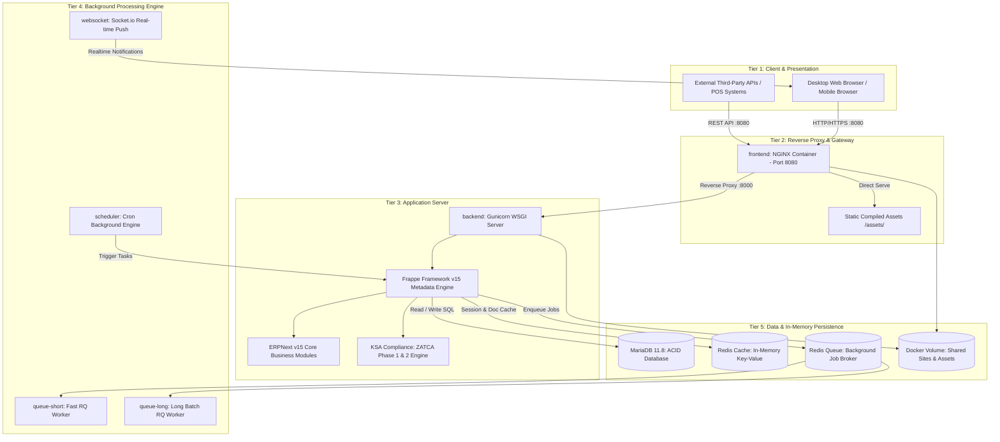

# System Architecture & Multi-Tier Topology
## Saudi Accounting & ZATCA ERP Suite (v15)

---

### 1. Architectural Overview
The system follows a multi-tier, micro-orchestrated container architecture designed for high throughput, data sovereignty, and isolated operational concerns.

---

### 2. The 9 Docker Containers Explained

1. **`frontend` (Nginx):** Terminates incoming HTTP traffic on port 8080, serves compiled JS/CSS bundles directly from the shared volume, and proxies dynamic `/api/` and `/app/` calls to the Gunicorn WSGI backend.
2. **`backend` (Gunicorn/Frappe):** Runs the Python application server hosting Frappe Framework, ERPNext business logic, and the Saudi ZATCA e-invoicing engine.
3. **`db` (MariaDB 11.8):** High-performance relational database using InnoDB transactional engine, hosting the complete Saudi Chart of Accounts, General Ledger, and transaction history.
4. **`redis-cache`:** In-memory caching layer storing user authentication tokens, system configurations, and pre-compiled DocType schemas for sub-millisecond retrieval.
5. **`redis-queue`:** Message broker managing background asynchronous job queues.
6. **`queue-short`:** Dedicated worker processing sub-second asynchronous tasks (e.g., immediate invoice background validations, print rendering, single emails).
7. **`queue-long`:** Dedicated worker executing long-running batch jobs (e.g., bulk report generation, database backups, monthly payroll runs).
8. **`scheduler`:** Frappe scheduler running periodic cron jobs, automatic bank feeds, and recurring invoice automation.
9. **`websocket`:** Node.js / Socket.io server providing real-time notification push to connected browser sessions.
