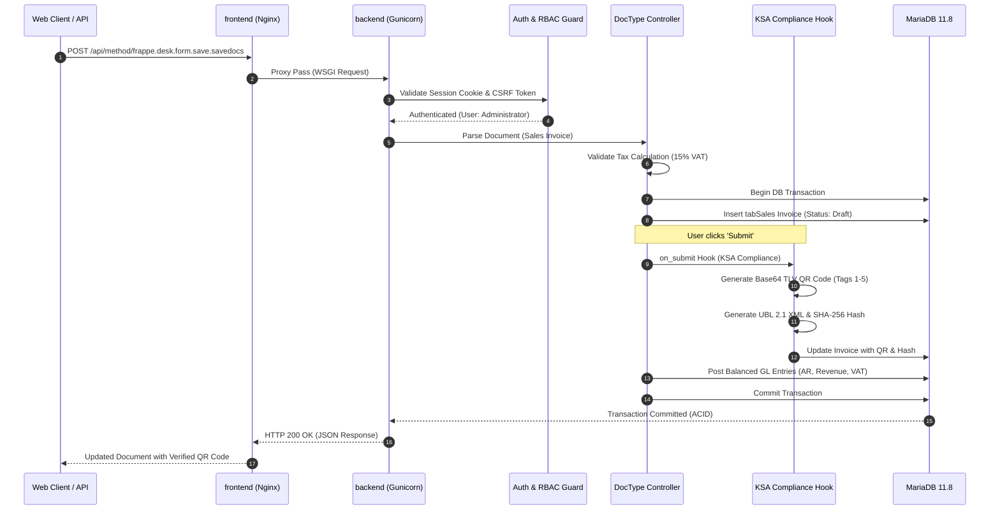

# Backend Architecture & Execution Flow
## Saudi Accounting & ZATCA ERP Suite (v15)

---

### 1. Request Lifecycle & Controller Flow
Every incoming HTTP request traverses a strictly validated, decoupled execution pipeline:



---

### 2. Modularity & Hook Architecture
The platform preserves core ERPNext upgradeability by leveraging the **Frappe Hooks Pattern**. Custom Saudi regulatory logic attaches asynchronously via `hooks.py`:

```python
# apps/ksa_compliance/ksa_compliance/hooks.py
doc_events = {
    "Sales Invoice": {
        "validate": "ksa_compliance.events.sales_invoice.validate",
        "on_submit": "ksa_compliance.events.sales_invoice.on_submit",
        "on_cancel": "ksa_compliance.events.sales_invoice.on_cancel"
    }
}
```

This guarantees:
- **Zero Core Tampering:** ERPNext core files remain 100% clean and vendor-updateable.
- **Strict Isolation:** All Saudi-specific ZATCA XML, QR, and certificate logic lives entirely inside `apps/ksa_compliance/`.
