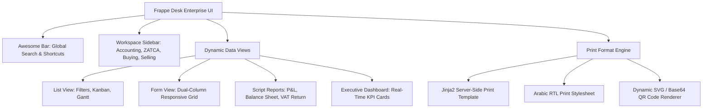

# Frontend Architecture & User Interface
## Saudi Accounting & ZATCA ERP Suite (v15)

---

### 1. Frontend Architecture Overview
The user interface is powered by **Frappe Desk**, an enterprise single-page application (SPA) runtime engineered with Vue.js, HTML5, CSS3, and responsive JavaScript components.

---

### 2. Bilingual Support (Arabic RTL & English LTR)
The interface supports on-the-fly switching between:
- **Arabic (العربية):** Full Right-to-Left (RTL) layout alignment, translated labels, and Saudi tax invoice terminology (فاتورة ضريبية / فاتورة ضريبية مبسطة).
- **English:** Left-to-Right (LTR) international financial layout.
- **Dual-Language Invoices:** Print formats generate bilingual invoices compliant with Article 53 of the Saudi VAT Implementing Regulations requiring bilingual tax invoices.
