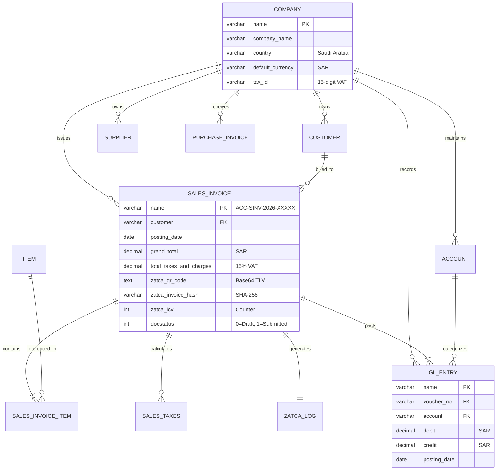

# Database Architecture & Entity Relationship Diagram (ERD)
## Saudi Accounting & ZATCA ERP Suite (v15)

---

### 1. Database Specifications
- **RDBMS Engine:** MariaDB 11.8.x (InnoDB Storage Engine)
- **Character Set:** `utf8mb4` (Complete Unicode support including Arabic diacritics and emojis)
- **Collation:** `utf8mb4_unicode_ci`
- **Isolation Level:** `READ-COMMITTED` with row-level locking

---

### 2. Entity Relationship Diagram (ERD)

---

### 3. Verified Audit Snapshot (Live Database State)
- **Company:** `Saudi Trading & Services Co.` (Tax ID: `310123456700003`)
- **Total Balanced GL Entries:** 15 transactions
- **Total Debit:** `SAR 21,525.00` | **Total Credit:** `SAR 21,525.00` | **Variance:** `0.00` (100% Balanced)
