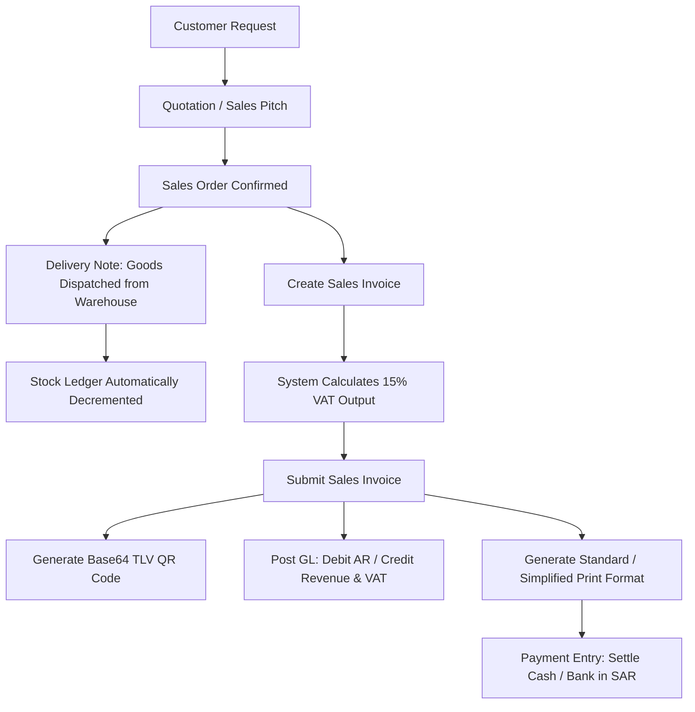
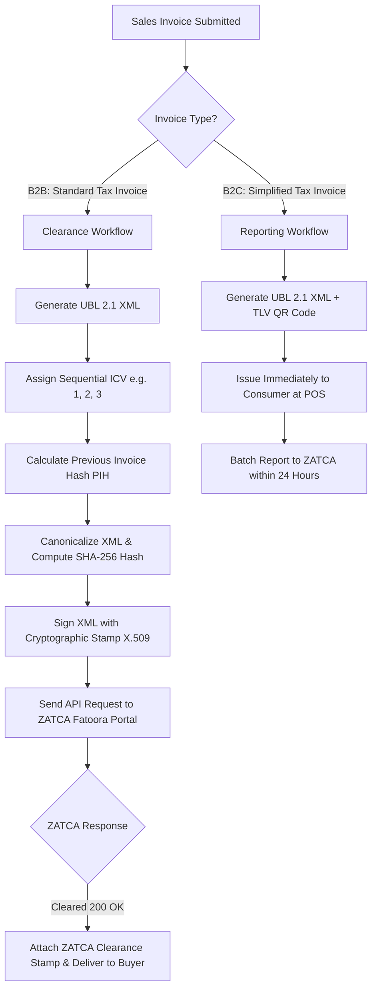
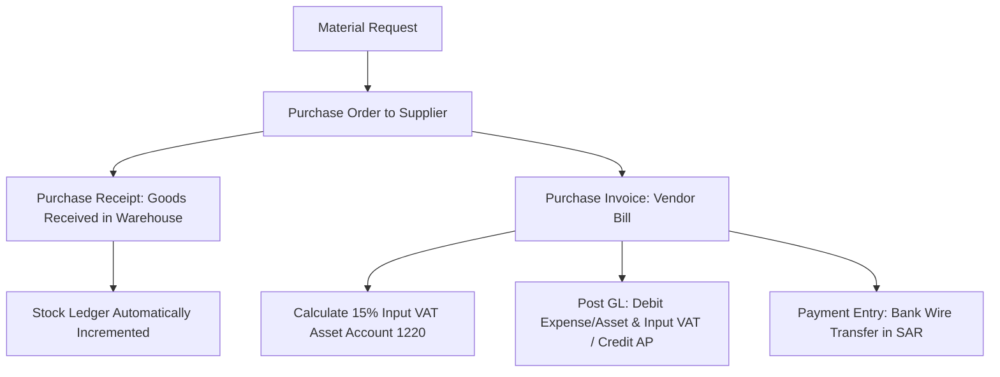

# Business Workflows & Module Flowcharts
## Saudi Accounting & ZATCA ERP Suite (v15)

---

### 1. Order-to-Cash (O2C) Workflow with ZATCA Phase 1 QR

---

### 2. ZATCA Phase 2 E-Invoicing Clearance & Reporting Engine

---

### 3. Procure-to-Pay (P2P) Workflow & Input VAT Reclamation

