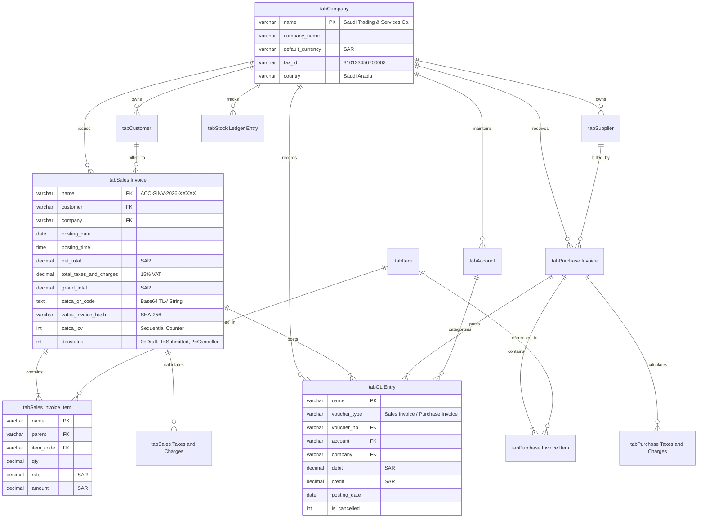

# Database Architecture & Entity Relationship Diagram (ERD)
## Saudi Accounting & ZATCA ERP Suite (v15)

---

## 1. Database Architecture Specifications
- **Database Engine:** MariaDB 11.8 (Enterprise Relational Database)
- **Default Storage Engine:** InnoDB (ACID compliant, row-level locking, foreign key constraints)
- **Character Set:** `utf8mb4`
- **Collation:** `utf8mb4_unicode_ci` (Full native sorting and searching for Arabic text)
- **Connection Pooling:** Managed through Gunicorn WSGI workers and MariaDB thread pool

---

## 2. Entity Relationship Diagram (ERD)



---

## 3. Key Table Schemas & Column DDL

### Table: `tabSales Invoice`
```sql
CREATE TABLE `tabSales Invoice` (
  `name` varchar(140) NOT NULL PRIMARY KEY,
  `creation` datetime(6) DEFAULT NULL,
  `modified` datetime(6) DEFAULT NULL,
  `modified_by` varchar(140) DEFAULT NULL,
  `owner` varchar(140) DEFAULT NULL,
  `docstatus` int(1) NOT NULL DEFAULT 0,
  `title` varchar(140) DEFAULT NULL,
  `naming_series` varchar(140) DEFAULT NULL,
  `customer` varchar(140) DEFAULT NULL,
  `customer_name` varchar(140) DEFAULT NULL,
  `company` varchar(140) DEFAULT NULL,
  `posting_date` date DEFAULT NULL,
  `posting_time` time(6) DEFAULT NULL,
  `currency` varchar(140) DEFAULT 'SAR',
  `conversion_rate` decimal(21,9) NOT NULL DEFAULT 1.0,
  `net_total` decimal(21,9) NOT NULL DEFAULT 0.0,
  `total_taxes_and_charges` decimal(21,9) NOT NULL DEFAULT 0.0,
  `grand_total` decimal(21,9) NOT NULL DEFAULT 0.0,
  `outstanding_amount` decimal(21,9) NOT NULL DEFAULT 0.0,
  `status` varchar(140) DEFAULT 'Draft',
  `zatca_qr_code` longtext DEFAULT NULL,
  `zatca_invoice_hash` varchar(255) DEFAULT NULL,
  `zatca_icv` int(11) DEFAULT NULL,
  KEY `customer` (`customer`),
  KEY `company` (`company`),
  KEY `posting_date` (`posting_date`)
) ENGINE=InnoDB DEFAULT CHARSET=utf8mb4 COLLATE=utf8mb4_unicode_ci;
```

### Table: `tabGL Entry`
```sql
CREATE TABLE `tabGL Entry` (
  `name` varchar(140) NOT NULL PRIMARY KEY,
  `posting_date` date DEFAULT NULL,
  `transaction_date` date DEFAULT NULL,
  `account` varchar(140) DEFAULT NULL,
  `party_type` varchar(140) DEFAULT NULL,
  `party` varchar(140) DEFAULT NULL,
  `cost_center` varchar(140) DEFAULT NULL,
  `debit` decimal(21,9) NOT NULL DEFAULT 0.0,
  `credit` decimal(21,9) NOT NULL DEFAULT 0.0,
  `account_currency` varchar(140) DEFAULT 'SAR',
  `debit_in_account_currency` decimal(21,9) NOT NULL DEFAULT 0.0,
  `credit_in_account_currency` decimal(21,9) NOT NULL DEFAULT 0.0,
  `voucher_type` varchar(140) DEFAULT NULL,
  `voucher_no` varchar(140) DEFAULT NULL,
  `company` varchar(140) DEFAULT NULL,
  `is_cancelled` int(1) NOT NULL DEFAULT 0,
  KEY `account` (`account`),
  KEY `voucher_no` (`voucher_no`),
  KEY `posting_date` (`posting_date`),
  KEY `company` (`company`)
) ENGINE=InnoDB DEFAULT CHARSET=utf8mb4 COLLATE=utf8mb4_unicode_ci;
```
