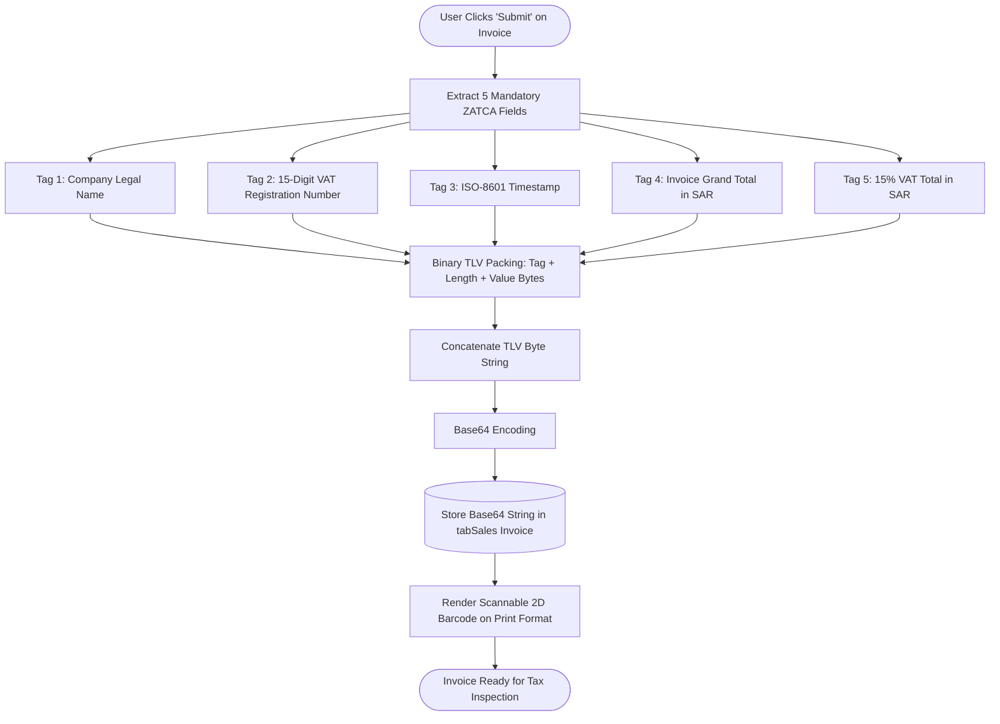
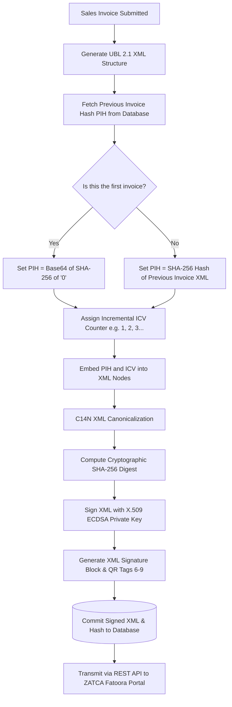
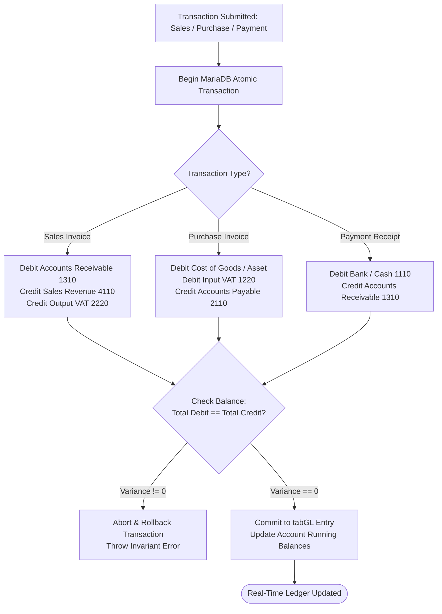

# Detailed Module Flow Diagrams
## Saudi Accounting & ZATCA ERP Suite (v15)

---

## 1. ZATCA Phase 1 TLV QR Code Generation Flowchart

---

## 2. ZATCA Phase 2 Cryptographic Hash Chaining Flowchart

---

## 3. Financial Ledger Posting & Double-Entry Balancing Flowchart

